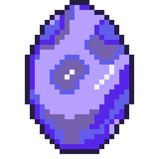

# Medi-Mate - FRONT-END

There are many people who would like to meditate, but struggle to build that habit.


Our app uses gamification to encourage daily visits to build that meditation habit. Along with your chosen Medi-Mate, you will learn to breath and meditate alongisde your new friend and keep them happy and healthy.

Looking for the [Back-end?](https://github.com/SchoolOfCode/final-project_back-end-bootglampers)

Live [website](https://medi-mate.netlify.app/)


## Features
- **Landing page** The landing page includes our login and signup autherisation process provided by firebase and includes a couple of sentences to get you orientated within the app.
- **Registration** If you are a new friend of Medi-mate's you will be asked to choose an egg for your Medi-Mate to hatch from and then give them a name, so you can start your journey together.
- **Home Hub** This is the central hub of the app, where your Medi-Mate lives and you have navigation options to get to the rest of the app.
- **Mood logger**  tracks your mood across time and will display your hopefully improving mood in the stats section.
- **Meditation page** On this page you can pick your total length of mediation also breath in and breath out timings. Your Medi-Mate will guide you through the meditation by animating rings in and out for you to time your breathing to.
- **Quotes** a page that provides Zen quotes for you to think about during your meditation or to start your day off right with some insightful thoughts.
- **Stats** This page shows interesting stats, such as your total meditation time, your Medi-Mates age, your total amount of times meditated and many more.

## Installation

```bash
  git clone https://github.com/SchoolOfCode/medi-mate-front-end.git
  
  cd medi-mate-front-end
  
  npm i

```

## Run the front-end
To run the front end:

```bash
  expo start
```


## Roadmap
### Next Steps for features
- Introducing more Medi-Mate sprites, as this was asked for during our user research and would help move this from MVP to MLP
- Animating the Medi-Mate on the home screen to show how much you've meditated such as; no meditation: your Medi-mate would be on the floor not moving, some meditation: your Medi-Mate would be walking around, lots of meditation: your Medi-Mate would be flying around the screen.
- Points earned when player reaches streak goals, such as week, month etc. To be spent on customisable accesories for your Medi-Mate
- Pause after meditation to log what you are grateful for
- Ability to add a hold breath option inbetween in and out breaths
- Optional ocean sounds with toggle on/off during meditation

### Next steps for code
- Writing tests for every component and screen and testing the navigation functions. We have the testing modules installed and the enviroment set up to do this

### Possible Stretch Goals
- Play games with your Medi-Mate
- Evolution of Medi-Mate over time
- Compare stats with friends and have a leaderboard
- Pet talks to you and keeps you motivated
- Pet to be happy or sad based on regular meditation

## Known Issues
Re-sizing for various devices is in the beta phase, so there may be some design issues on some devices.

## Accessibility
82% Accessibility on google Lighthouse. We would aim to improve on this in future development.

## Running Tests
To run tests:

```bash
  npm run test
```

## Tech Stack

<div align="left">
<a href="https://reactnative.dev/" target="_blank"></a>
<a href="https://beta.reactjs.org/" target="_blank"></a>
<a href="https://www.w3schools.com/css/" target="_blank"></a>
<a href="https://www.javascript.com/" target="_blank"></a>
<a href="https://github.com/" target="_blank"></a>
<a href="https://docs.expo.dev/" target="_blank"></a>
<a href="https://firebase.google.com/" target="_blank"></a>
<a href="https://babeljs.io/" target="_blank"></a>
<a href="https://nodejs.org/" target="_blank"></a>
<a href="https://expressjs.com/" target="_blank"></a>
<a href="https://www.postgresql.org/" target="_blank"></a>
<a href="https://heroku.com" target="_blank">  </a>
<a href="https://jestjs.io" target="_blank"> </a>
<a href="https://postman.com" target="_blank">  </a>
<a href="https://github.com/software-mansion/react-native-reanimated" target="_blank"></a>
<a href="https://reactnavigation.org/" target="_blank"></a>
<a href="https://callstack.github.io/react-native-testing-library/" target="_blank"></a>
<a href="https://www.netlify.com/" target="_blank"></a>
<a href="https://trello.com/" target="_blank"></a>
<a href="https://miro.com/" target="_blank"></a>
<a href="https://www.piskelapp.com/" target="_blank"></a>
<a href="https://www.aseprite.org/" target="_blank"></a>
</div>

### The reasons behind the techstack we choose
react native - mobile first design principles, and one of our goals for this project was to challange ourselves and keep learning new technology
expo - expo enabled us to test on devices as we went, using other CLI's would have forced us to set up simulators the interactions between expo and react native are also well doumented.
react native testing library - we tried a few different testing librarys that would work with Jest as we have worked with Jest before.
Heroku - we have mostly worked with SQL databases and our back end didn't need to have too much functionality to validate the mvp of this idea
Netlify - its not as hard as others
firebase


## Authors

- [@Emma Kennard](https://github.com/Elkennard)
- [@Raina Blackett](https://github.com/chocorainaaa)
- [@Lorentz Bloom](https://github.com/Lauro235)
- [@Lewis Parr](https://github.com/Le-w-is)
